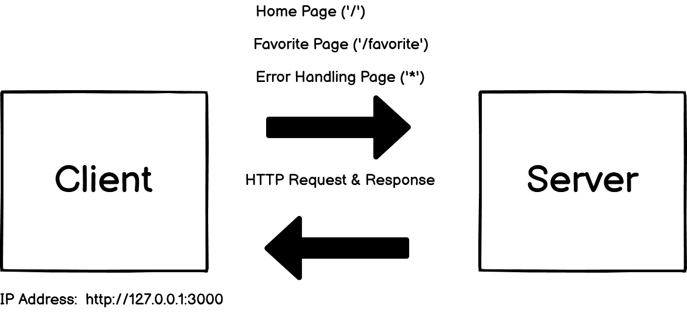

# Movies-Library 1.0.0

**Author Name**: Laith Alalamat

## WRRC

## Overview

A simple movie library project

## Getting Started
Steps for building a server 2/20/2022 Sunday 
1- Create server.js file

2- npm init -y

3- npm install express

4- const express = require("express")

5- const app = express()

6- app.listen(PORT, ()=>{ console.log("Anything") })

7- I can create end points (ex: app.get("/", helloWorldHandler))

8- I will create the function for that end point(ex: helloWorldHandler)

## Project Features
